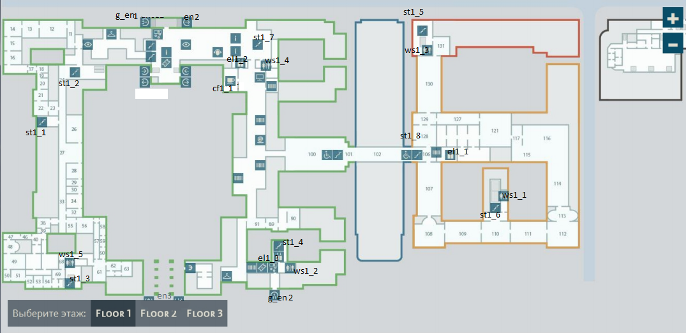
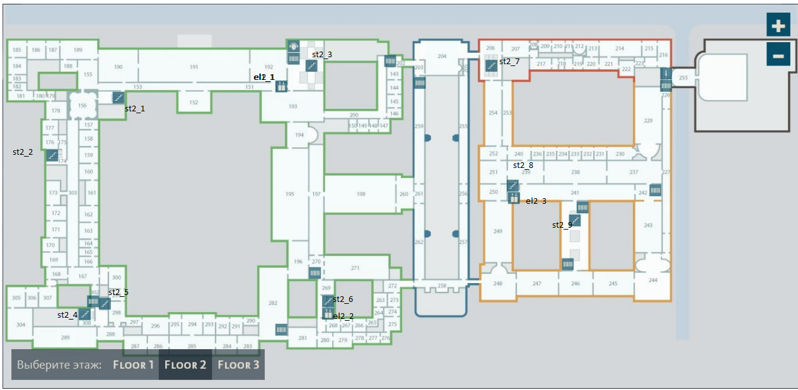
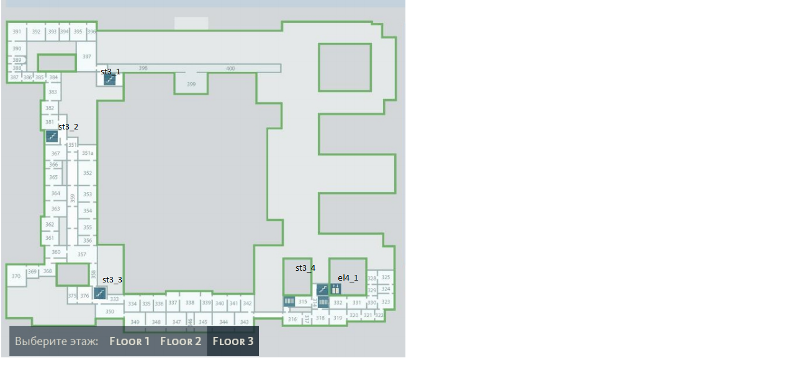

Bender server
===================

## [main address](http://77.244.216.138:3000/)

# API:
> **GET /get-rooms/** - возвращает данные о загруженности по этажам 
> **?** floor : 1 | 2 | 3 

> **GET /get-route/** - возвращает маршрут от from до to 
> **?** from: string & to: string 
> Номера комнат и специальных точек отмечены на карте ниже 

> **GET /get-buildings/** - возвращает данные о занятости по зданиям 

